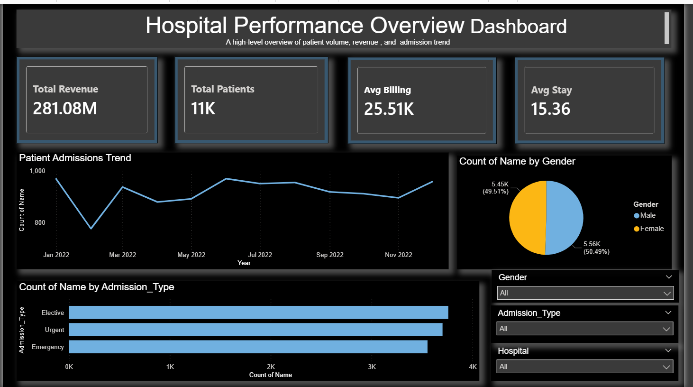
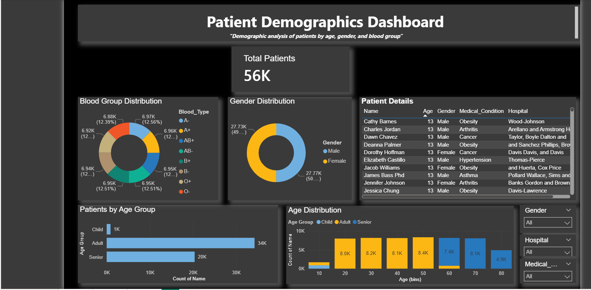
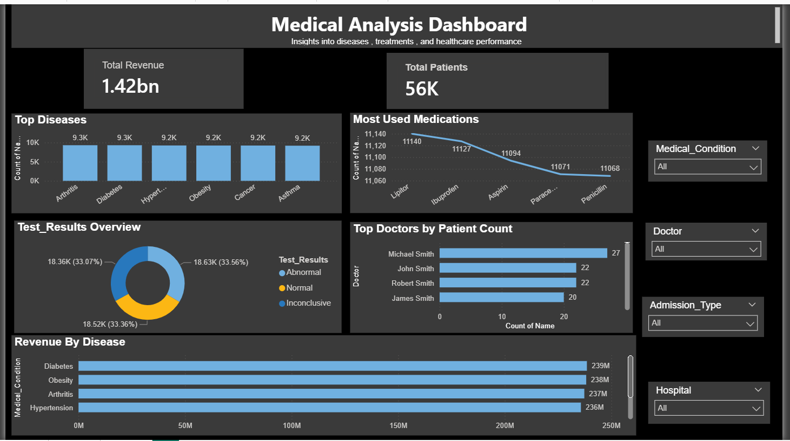

# Healthcare Dashboard Project

## 📊 Tools Used
- Excel
- MySQL
- Power BI

## 📌 Project Overview
This project analyzes healthcare data including patient demographics, billing, and hospital performance.

## 📈 Key Insights
- Total Patients: 56K
- Revenue Analysis
- Age Group Distribution
- Admission Type Trends

## Dashboard Preview

### Page 1

### Page 2

### Page 3

## 📂 Files Included
- healthcare_dataset.csv
- Healthcare Dashboard.pbix
- [Dashboard](images/dashboard.png)

## 🚀 Author
Sachin Nikkam
